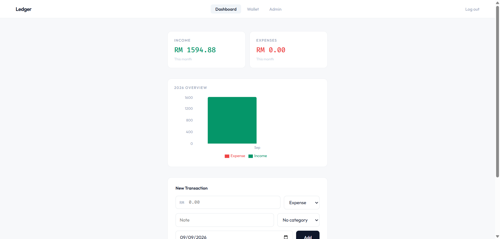
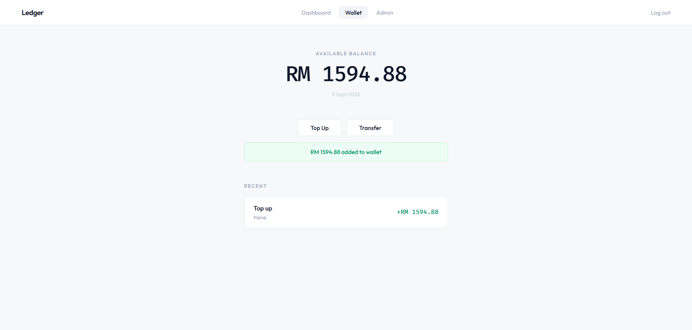
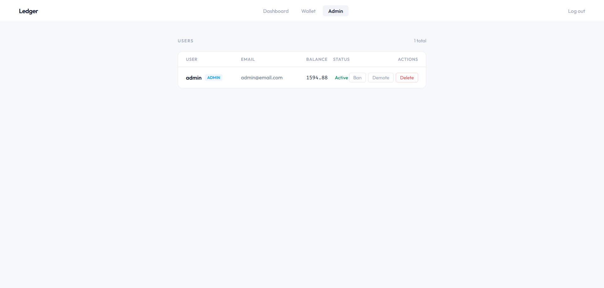
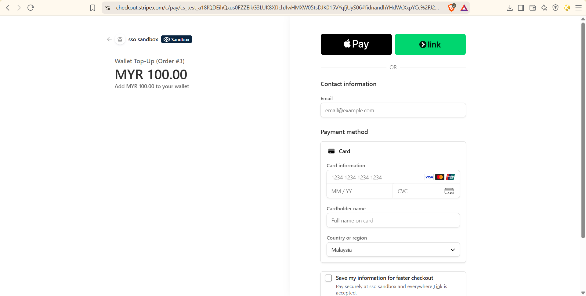

# Ledger

Ledger is a Personal finance app, users can track income/expenses, top up a wallet, and send money to each other. Payments go through Stripe Checkout (test mode). The wallet uses double-entry bookkeeping, and the payment pipeline handles idempotency and webhook signature verification to keep things consistent and to prevent duplicate charges. Payment orders follow a state machine (pending → processing → completed/failed) with Stripe confirming results via signed webhooks.

In desgin, the wallet uses double-entry bookkeeping so balances stay consistent, Stripe handles payments via redirect-based checkout, and webhooks keep order state in sync. Concurrency is managed with SELECT ... FOR UPDATE locking, idempotency keys, and rate limiting.


**[Live Demo](https://ledger-delta-seven.vercel.app)** · [API Docs](https://ledger-api-3jgm.onrender.com/docs)

The backend is on Render's free tier, so the first request may take around 30s to wake up.

## Screenshots

| | |
|---|---|
| [](docx/landing%20page.png) | [](docx/dashboard.png) |
| [](docx/wallet.png) | [](docx/admin.png) |
| [](docx/checkout.png) | |

## Architecture

[](docx/architecture.png)

## Setup

```bash
# backend
pip install -r requirements.txt
alembic upgrade head
uvicorn app.main:app --reload        # localhost:8000

# frontend
cd frontend && npm install
npm run dev                           # localhost:5173

# mock payment gateway
uvicorn gateway.main:app --port 9000  # localhost:9000
```

API docs at http://localhost:8000/docs

## API

| Method | Endpoint | Auth | Description |
|---|---|---|---|
| POST | /auth/register | — | Create account |
| POST | /auth/login | — | Get JWT token |
| GET/POST/PATCH/DELETE | /transactions/* | JWT | Bookkeeping CRUD |
| GET/POST/PATCH/DELETE | /categories/* | JWT | Income/expense categories |
| GET | /wallet | JWT | Check balance |
| POST | /wallet/topup | JWT | Add funds |
| POST | /wallet/transfer | JWT | P2P transfer |
| GET | /wallet/history | JWT | Ledger entries |
| GET/POST | /orders/* | JWT | Payment orders |
| POST | /webhook/stripe | — | Stripe webhook (signature-verified) |
| GET/PATCH/DELETE | /admin/* | Admin | User management |

## Stack

**Backend:** Python · FastAPI · SQLAlchemy · Alembic · PostgreSQL · PyJWT · bcrypt · Stripe · slowapi · tenacity

**Frontend:** React · Vite · Axios · Recharts

## License

MIT
