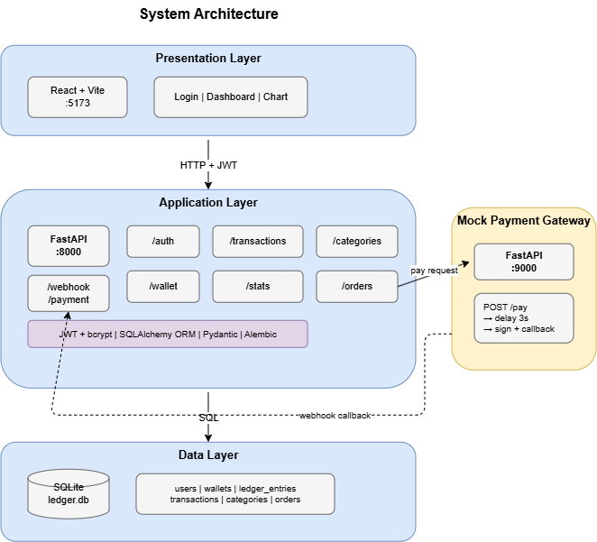
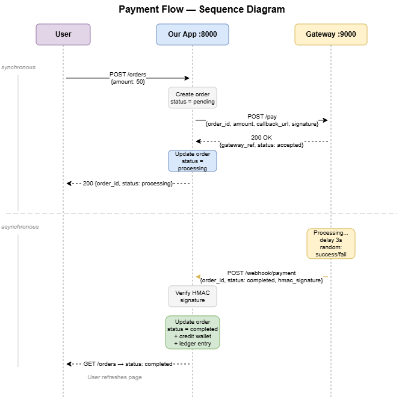

# Ledger

**[Live Demo](https://ledger-delta-seven.vercel.app)** · [API Docs](https://ledger-api-3jgm.onrender.com/docs)

Personal finance and e-wallet app with a mock payment gateway.

Wallet transfers are atomic, ledger uses double-entry bookkeeping, and payment webhooks are HMAC-signed.

Built with FastAPI, React, and SQLite.

## Architecture



## Payment flow



## Setup

```bash
# backend
pip install -r requirements.txt
alembic upgrade head
uvicorn app.main:app --reload        # localhost:8000

# frontend
cd frontend && npm install
npm run dev                           # localhost:5173

# mock payment gateway
uvicorn gateway.main:app --port 9000  # localhost:9000
```

API docs at http://localhost:8000/docs

## API

| Method | Endpoint | Auth | Description |
| ------ | -------- | ---- | ----------- |
| POST | /auth/register | — | Create account |
| POST | /auth/login | — | Get JWT token |
| GET/POST/PATCH/DELETE | /transactions/* | JWT | Bookkeeping CRUD |
| GET/POST/PATCH/DELETE | /categories/* | JWT | Income/expense categories |
| GET | /wallet | JWT | Check balance |
| POST | /wallet/topup | JWT | Add funds |
| POST | /wallet/transfer | JWT | P2P transfer |
| GET | /wallet/history | JWT | Ledger entries |
| GET/POST | /orders/* | JWT | Payment orders |
| POST | /webhook/payment | — | Gateway callback (HMAC verified) |
| GET/PATCH/DELETE | /admin/* | Admin | User management |

## Stack

**Backend:** Python · FastAPI · SQLAlchemy · Alembic · SQLite · PyJWT · bcrypt · httpx

**Frontend:** React · Vite · Axios · Recharts

**Gateway:** Separate FastAPI service with HMAC-SHA256 webhook signing

## License

MIT
